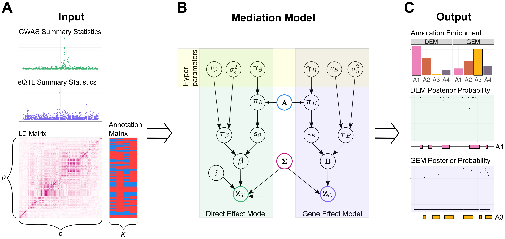

# iFunMed: Integrative Functional Mediation Analysis of GWAS and eQTL

## Overview

*iFunMed* is a mediation model that utilizes functional annotation data as prior information and builds on summary statistics from GWAS and eQTL  studies. *iFunMed* model capitalizes on the functional annotation information when modeling the probability that a given SNP has a non-zero direct or indirect effect and, as a result, enables identification of SNPs that are associated with phenotypical changes through direct  phenotype-genotype  and/or indirect  phenotype-genotype through gene expression effect. Furthermore, we propose a pipeline to enable selection of the functional annotations for direct and indirect effect models based on enrichment measurements. 




## iFunMed Model Fitting

We provide an example data file (`example_data.RData`) for new users to get familiar with *iFunMed*. It consist of small set of 500 SNPs and contains the input for the model:
- GWAS.summstat: GWAS summary statistics
- eQTL.summstat: eQTL summary statistics
- LD.matrix: LD matrix (500x500)
- annotation.matrix: Functional annotation matrix with 5 different binary annotations (500x5)

`iFunMed_base.r` has the necessary elemets to run the model and consists, mainly, of four functions: 
- `vemMedSS`: Fit the direct effect part of the mediation model, adjusted by the mediator ().
- `vemDirectSS`: Fit the gene effect part of the mediation model ().
- `processFunMed`: Summarize output. 
- `lbAnno`: Calculates enrichment values for the annotation matrix using the *iFunMed* fit without annotation.


Once you read the R code and load the data into your R session, you can fit *iFunMed*. You can run the model with annotation directly, or following the annotation selection pipeline.

```
source('iFunMed_base.r')
load('example_data.RData')
```

### 1. Annotation Model

Let's say that out of the 5 annotations, we are only interested in the fifth annotation (`A5`). `anno.iFunMed` will be a 500x2 annotation matrix where the first column represents the intercept (all ones) and the second column if the `A5` binary annotation information. 
Then, we fit the model in a two step fashion with the functions `vemDirectSS` and `vemMedSS`.

```
anno.iFunMed <- cbind(1, annotation.matrix[, 'A5'])
vem.r.anno <- vemDirectSS(LD.matrix, wzy = eQTL.summstat, anno = anno.iFunMed)
vem.ymed.anno <- vemMedSS(LD.matrix, wzy = GWAS.summstat, wzr = eQTL.summstat, anno = anno.iFunMed)
```
`vem.r.anno` and `vem.ymed.anno` are objects that represent the direct and direct effect model. We can use the `processFunMed` function to summarize the main outputs:

```
temp.output <- list()
temp.output[['model.opt']] <- list(IEM = vem.r.anno, DEM = vem.ymed.anno)
iFunMedAnno.output <- processFunMed(temp.output)
```
`iFunMedAnno.output` is a list with the following information:

- Convergency: Number of iterations and convergency status for direct and indirect efect models.
- Parameters: Direct and indirect effect estimated model parameters.
- PostProb: Posterior Probability of  inclusion (non-zero effect size) and FDR-corrected values for direct and indirect efect models.

### 2. Annotation Selection Pipeline

#### 2.1 Fit Model Without Annotation (Null Model)

Similarly as in Section 1., we fit the model in a two step fashion with the functions `vemDirectSS` and `vemMedSS`. Since we are fitting the null model (without annotation), we set `anno = NULL` in both of them, which is also the default.
```
vem.r.null <- vemDirectSS(LD.matrix, wzy = eQTL.summstat, anno = NULL)
vem.ymed.null <- vemMedSS(LD.matrix, wzy = GWAS.summstat, wzr = eQTL.summstat, anno = NULL)
```
We use `processFunMed` function to summarize the main outputs:
```
temp.output <- list()
temp.output[['model.opt']] <- list(IEM = vem.r.null, DEM = vem.ymed.null)
iFunMedNull.output <- processFunMed(temp.output)
```

#### 2.2 Measure Annotation Enrichment 

First, we obtain direct and indirect effect posterior porbabilities from the null model object `iFunMedNull.output`.

```
post.null <- list(IEM = iFunMedNull.output[['PostProb']][['IEM']][['PP']],
		DEM = iFunMedNull.output[['PostProb']][['DEM']][['PP']])
```

Second, we calculate the average posterior probability of inclusion of the SNPs with the annotation, for each annotation ( and  in the manuscript).

```
post.meananno.null <- lapply(post.null, function(x) apply(annotation.matrix[, 1:5], 2, meanAnno, x = x))
```

Finally, we obtain the measurement of enrichment for each annotation ( and  in the manuscript).

```
anno.enrichment <- mclapply(names(post.null), function(x) sapply(1:length(idanno), function(y) lbAnno(post.null[[x]], annotation.matrix[, y], post.meananno.null[[x]][y], nrep = 5000)), mc.cores = 20, mc.preschedule = FALSE)
names(anno.enrichment) <- names(post.null)
names(anno.enrichment[['IEM']]) <- names(anno.enrichment[['IEM']])
names(anno.enrichment[['DEM']]) <- names(anno.enrichment[['DEM']])
```

#### 2.3 Fit Model With Most Enriched Annotations 

Based on enrichment results, we can fit the model with the most enriched annotation. Alternatively, multiple annotations can be used.

```
anno.chosen <- lapply(anno.enrichment, function(x) which.min(x))
annomtx.IEM <- cbind(1, annotation.matrix[, anno.chosen[['IEM']]])
annomtx.DEM <- cbind(1, annotation.matrix[, anno.chosen[['DEM']]])

vem.r.anno <- vemDirectSS(LD.matrix, wzy = eQTL.summstat, anno = annomtx.IEM )
vem.ymed.anno <- vemMedSS(LD.matrix, wzy = GWAS.summstat, wzr = eQTL.summstat, anno = annomtx.DEM)
```

Similarly, we use `processFunMed` to summarize results:

```
temp.output <- list()
temp.output[['model.opt']] <- list(IEM = vem.r.anno, DEM = vem.ymed.anno)
iFunMedAnno.output <- processFunMed(temp.output)
```

